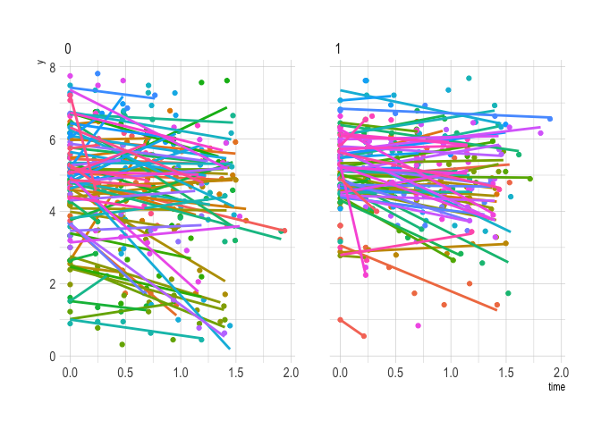

Multilevel structures
================

## Question 1

``` r
apt <- read.table(str_c(arm_url, 'rodents/apt.dat'))
dis <- read.table(str_c(arm_url, 'rodents/dist.dat'))
```

### (a)

\[
P(y_{ij} = 1) = \text{logit}^{-1} \left( \beta_0  + \beta_1 \times \text{race}_i + \beta_2 \times \text{floor}_i + \beta_3 \times \text{bldg}_i + \alpha_j \right)
\]

### (b)

\[
\begin{align}
P(y_{i} = 1) &= \text{logit}^{-1} \left( \beta_0 + \beta_1 \times \text{race}_i + \beta_2 \times \text{floor}_i + \beta_3 \times \text{bldg}_i + \alpha_{j[i]} \right) \\
\alpha_{j[i]} &\sim N \left( \gamma_0 + \gamma_1 \times \text{defects}_j + \gamma_2 \times \text{poor}_j, \sigma_{\alpha} ^ 2 \right)
\end{align}
\]

## Question 2

Skip

## Question 3

``` r
win32 <- read_table2(str_c(arm_url, 'olympics/olympics1932.txt'), skip = 20)
```

### (a)

``` r
pro32 <- cbind(1:7, win32[seq(1, 14, by = 2), 3:9])
pro32 %<>% as_tibble()
names(pro32) <- c('pair', str_c('judge_', 1:7))
print(pro32)
```

    ## # A tibble: 7 x 8
    ##    pair judge_1 judge_2 judge_3 judge_4 judge_5 judge_6 judge_7
    ##   <int>   <dbl>   <dbl>   <dbl>   <dbl>   <dbl>   <dbl>   <dbl>
    ## 1     1     5.6     5.5     5.8     5.3     5.6     5.2     5.7
    ## 2     2     5.5     5.2     5.8     5.8     5.6     5.1     5.8
    ## 3     3     6       5.3     5.8     5       5.4     5.1     5.3
    ## 4     4     5.6     5.3     5.8     4.4     4.5     5       5.1
    ## 5     5     5.4     4.5     5.8     4       5.5     4.8     5.5
    ## 6     6     5.2     5.1     5.3     5.4     4.5     4.5     5  
    ## 7     7     4.8     4       4.7     4       3.7     4       4.8

``` r
per32 <- cbind(1:7, win32[seq(2, 14, by = 2), 2:8])
per32 %<>% as_tibble()
names(per32) <- c('pair', str_c('judge_', 1:7))
print(per32)
```

    ## # A tibble: 7 x 8
    ##    pair judge_1 judge_2 judge_3 judge_4 judge_5 judge_6 judge_7
    ##   <int> <chr>     <dbl>   <dbl>   <dbl>   <dbl>   <dbl>   <dbl>
    ## 1     1 5.6         5.5     5.8     4.7     5.7     5.3     5.4
    ## 2     2 5.5         5.7     5.6     5.4     5.5     5.3     5.7
    ## 3     3 6.0         5.5     5.7     4.9     5.5     5.2     5.7
    ## 4     4 5.6         5.3     5.8     4.8     4.5     5       5.5
    ## 5     5 4.8         4.8     5.5     4.4     4.6     4.8     5.2
    ## 6     6 4.8         5.6     5       4.7     4       4.6     5.2
    ## 7     7 4.3         4.6     4.5     4       3.6     4       4.8

### (b)

I think there is a typo here in that the output is \(49 \times 4\).

``` r
# join scores after converting to long
dat <- left_join(
  gather(pro32, judge, score, -pair),
  gather(per32, judge, score, -pair),
  by = c('pair', 'judge')
)

# convert to numeric
dat %<>% 
  mutate(
    judge = str_replace_all(judge, 'judge_', '')
  ) %>%
  mutate_at(vars(score.x, score.y, judge), as.numeric)
  

# add names and rearrange
names(dat)[3:4] <- c('tech', 'perf')
dat <- dat[c(3:4, 1:2)]

# print
print(dat, n = 5)
```

    ## # A tibble: 49 x 4
    ##    tech  perf  pair judge
    ##   <dbl> <dbl> <int> <dbl>
    ## 1   5.6   5.6     1     1
    ## 2   5.5   5.5     2     1
    ## 3   6     6       3     1
    ## 4   5.6   5.6     4     1
    ## 5   5.4   4.8     5     1
    ## # ... with 44 more rows

### (c)

``` r
dat %<>%
  mutate(
    same = case_when(
      pair == 1 & judge == 5 ~ 1,
      pair == 2 & judge == 7 ~ 1,
      pair == 3 & judge == 1 ~ 1,
      pair == 4 & judge == 1 ~ 1,
      pair == 7 & judge == 7 ~ 1,
      T ~ 0
    )
  )
```

## Question 4

### (a)

Note that in the online documentation it is suggested to consider
paitents whose initial age is between one and five.

``` r
# load the data
cd4 <- read_csv(str_c(arm_url, 'cd4/allvar.csv'))
cd4 %<>% na.omit()

# filter and add outcome
dat <- cd4 %>%
  filter(baseage >= 1 & baseage <= 5) %>%
  mutate(
    time = visage - baseage,
    treatmnt = treatmnt - 1,
    y = sqrt(CD4PCT)
  ) %>%
  arrange(newpid)

# drop patients with no record of first visit
dat %<>% filter(!newpid %in% c(9, 35, 166))

# plot
p <- ggplot(dat) +
  geom_line(aes(time, y, colour = factor(newpid))) +
  guides(colour = F) +
  facet_wrap(~treatmnt) +
  theme_ipsum()
p
```

<!-- -->

### (b)

``` r
# plot
p <- ggplot(dat) +
  geom_point(aes(time, y, colour = factor(newpid))) +
  geom_smooth(aes(time, y, colour = factor(newpid)), method = 'lm', se = F) +
  guides(colour = F) +
  facet_wrap(~treatmnt) +
  theme_ipsum()
p
```

<!-- -->

### (c)

``` r
# step one
reg_a <- list()
for (i in seq_along(unique(dat$newpid))) {
  
  reg_a[[i]] <- lm(
    sqrt(CD4PCT) ~ time,
    data = filter(dat, newpid == unique(dat$newpid)[i])
  )
  
}

# step two
a <- map(reg_a, ~coef(.x)[1]) %>% flatten_dbl()
reg_b <- lm(a ~ treatmnt + baseage, data = filter(dat, VISIT == 1))
print(reg_b)
```

    ## 
    ## Call:
    ## lm(formula = a ~ treatmnt + baseage, data = filter(dat, VISIT == 
    ##     1))
    ## 
    ## Coefficients:
    ## (Intercept)     treatmnt      baseage  
    ##     4.99960      0.25900     -0.08096
