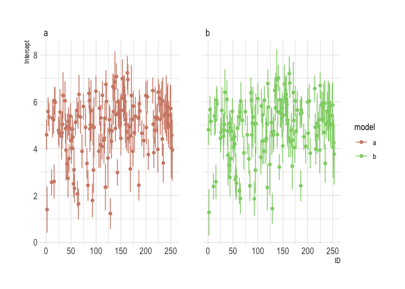
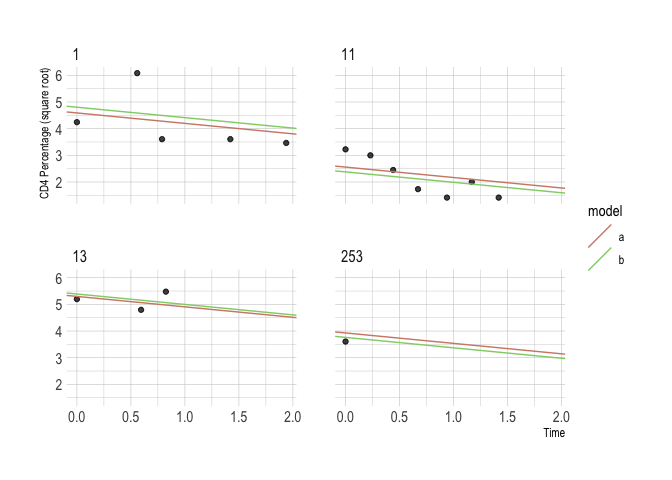
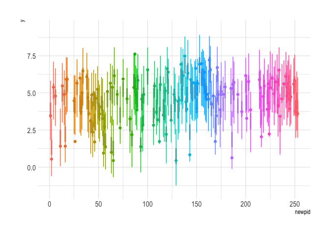
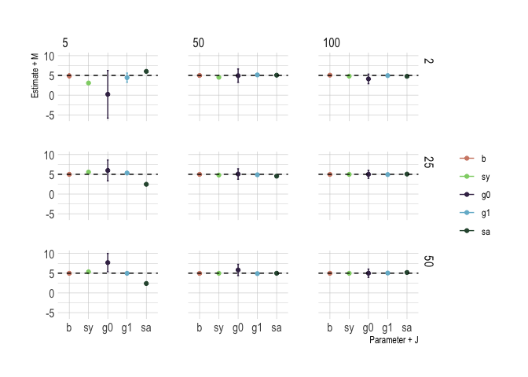
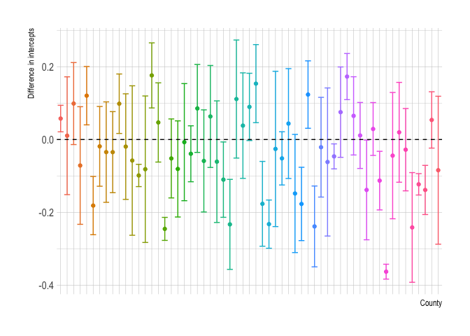
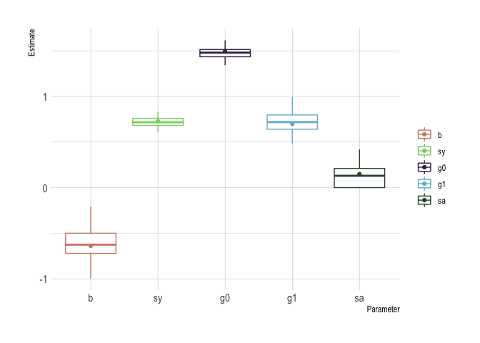
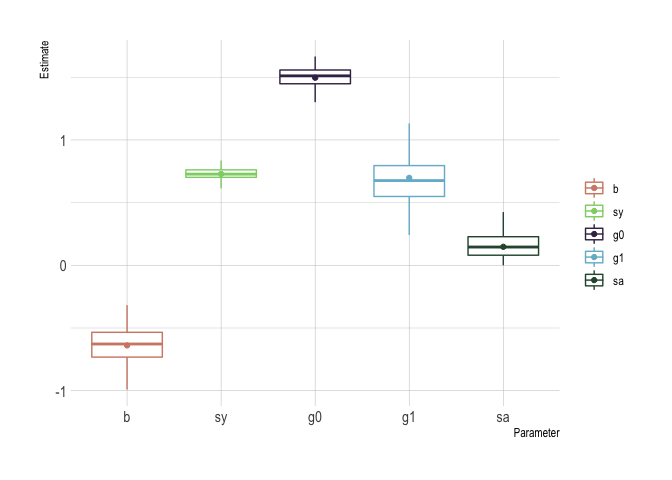

Multilevel linear models: the basics
================

## Question 1

Skip

## Question 2

``` r
# reload chapter 11, exercise 4
dat <- knitr::load_cache('arm11-q04a', 'dat')
```

### (a)

``` r
# fit the model
reg_a <- lmer(y ~ time + (1 | newpid), data = dat)
display(reg_a)
```

    ## lmer(formula = y ~ time + (1 | newpid), data = dat)
    ##             coef.est coef.se
    ## (Intercept)  4.91     0.12  
    ## time        -0.39     0.07  
    ## 
    ## Error terms:
    ##  Groups   Name        Std.Dev.
    ##  newpid   (Intercept) 1.30    
    ##  Residual             0.75    
    ## ---
    ## number of obs: 659, groups: newpid, 148
    ## AIC = 1874.9, DIC = 1854.6
    ## deviance = 1860.8

Note that the intercept corresponds to the square root of the patient’s
CD4 percentage at the start of treatment. The model indicates that the
square root of CD4 percentage decreases by 0.39 per year.

### (b)

``` r
# fit the model
reg_b <- lmer(y ~ time + treatmnt + baseage + (1 | newpid), data = dat)
display(reg_b)
```

    ## lmer(formula = y ~ time + treatmnt + baseage + (1 | newpid), 
    ##     data = dat)
    ##             coef.est coef.se
    ## (Intercept)  5.00     0.31  
    ## time        -0.39     0.07  
    ## treatmnt     0.34     0.23  
    ## baseage     -0.09     0.11  
    ## 
    ## Error terms:
    ##  Groups   Name        Std.Dev.
    ##  newpid   (Intercept) 1.29    
    ##  Residual             0.75    
    ## ---
    ## number of obs: 659, groups: newpid, 148
    ## AIC = 1880, DIC = 1848
    ## deviance = 1858.0

The model indicates that the square root of CD4 percentage decreases by
0.39 per year. Those who were treated had a level 0.34 above those who
were not treated after the two years. Finally, initial levels were 0.09
lower for each year of youth.

### (c)

``` r
# complete pooling (for reference in plot)
reg_pool <- lm(y ~ time + treatmnt + baseage, data = dat)
display(reg_pool)
```

    ## lm(formula = y ~ time + treatmnt + baseage, data = dat)
    ##             coef.est coef.se
    ## (Intercept)  5.06     0.18  
    ## time        -0.33     0.12  
    ## treatmnt     0.47     0.12  
    ## baseage     -0.14     0.06  
    ## ---
    ## n = 659, k = 4
    ## residual sd = 1.47, R-Squared = 0.04

``` r
# part (a)
pdat_a <- coef(reg_a)$newpid %>% as_tibble()
pdat_a %<>%
  mutate(
    se = se.ranef(reg_b)$newpid,
    newpid = unique(dat$newpid),
    model = "a"
  )

# part (b)
pdat_b <- coef(reg_b)$newpid %>% as_tibble()
pdat_b %<>%
  mutate(
    se = se.ranef(reg_b)$newpid,
    newpid = unique(dat$newpid),
    model = "b"
  ) %>%
  group_by(newpid) %>%
  mutate(
    `(Intercept)` = `(Intercept)` - 
      fixef(reg_b)[3] * treatmnt - 
      fixef(reg_b)[4] * baseage
  )

# outcomes
tmp <- select(dat, newpid, y, time)
tmp %<>% rename(t = time)
pdat_a %<>% right_join(mutate(tmp, model = "a"))
pdat_b %<>% right_join(mutate(tmp, model = "b"))

# bind
pdat <- bind_rows(pdat_a, pdat_b)

# add errors for intercepts
pdat %<>%
  mutate(
    lower = `(Intercept)` - 2 * se,
    upper = `(Intercept)` + 2 * se
  )
    
# full data and both fits
p1 <- ggplot(dat) +
  geom_point(aes(time, y), alpha = 0.5) +
  geom_abline(
    intercept = fixef(reg_a)[1],
    slope = fixef(reg_b)[2],
    col = ipsum_pal()(3)[1]
  ) +
  geom_abline(
    intercept = fixef(reg_b)[1],
    slope = fixef(reg_b)[2],
    col = ipsum_pal()(3)[2]
  ) +
  geom_abline(
    intercept = coef(reg_pool)[1],
    slope = coef(reg_pool)[4],
    col = ipsum_pal()(3)[3]
  ) +
  theme_ipsum() +
  labs(x = "Time", y = "CD4 Percentage (square root)")
p1
```

<!-- -->

``` r
# intercepts
p2 <- ggplot(
    aes(newpid, `(Intercept)`, colour = model),
    data = distinct(select(pdat, -y, -t, -treatmnt, -baseage))
  ) +
  geom_point(aes(newpid, `(Intercept)`, colour = model)) +
  geom_errorbar(aes(ymin = lower, ymax = upper)) +
  scale_colour_ipsum() +
  theme_ipsum() +
  facet_wrap(~model) +
  labs(x = "ID", y = "Intercept")
p2
```

<!-- -->

``` r
# example for children with N = {1, 3, 5, 7} observations
ymin <- min(filter(pdat, newpid %in% c(1, 11, 13, 253))$y)
ymax <- max(filter(pdat, newpid %in% c(1, 11, 13, 253))$y)

p3 <- ggplot(filter(pdat, newpid %in% c(1, 11, 13, 253))) +
  geom_point(aes(t, y), alpha = 0.5) +
  geom_abline(
    aes(intercept = `(Intercept)`, slope = time, colour = model)
  ) +
  scale_y_continuous(limits = c(ymin, ymax)) +
  scale_colour_ipsum() +
  theme_ipsum() +
  facet_wrap(~newpid, nrow = 2) +
  labs(x = "Time", y = "CD4 Percentage (square root)")
p3
```

<!-- -->

### (d)

The models are essentially the same.

## Question 3

### (a)

``` r
# sample size
N <- dat$newpid %>% unique() %>% length()

# time steps
t_steps <- diff(dat$time)
t_steps <- t_steps[t_steps > 0]

# simulated data
dat_sim <- tibble(
  newpid = unique(dat$newpid),
  treatmnt = filter(dat, VISIT == 1)$treatmnt,
  baseage = filter(dat, VISIT == 1)$baseage,
  time = sample(t_steps, N, replace = T),
  y = ranef(reg_a)$newpid[, 1] + fixef(reg_a)[1] + fixef(reg_a)[2] * time
)
```

### (b)

``` r
# sample size
N <- count(dat, newpid)$n %>% median()

# intercept
a <- rnorm(1, fixef(reg_a)[1], sigma.hat(reg_a)$sigma$newpid)

# time
time <- c(0, sample(t_steps, N - 1, replace = T))
time %<>% cumsum()

# simulated data
dat_sim <- tibble(
  newpid = max(dat$newpid) + 1,
  treatmnt = 1,
  baseage = 4,
  time = time,
  y = a + fixef(reg_a)[2] * time
)
```

## Question 4

``` r
# filter data using final visit
X <- dat %>%
  group_by(newpid) %>%
  filter(VISIT == max(VISIT)) %>%
  ungroup() %>%
  mutate(
    a = 1
  )
Xb <- as.matrix(select(X, a, time, treatmnt, baseage)) %*% fixef(reg_b)
Xb <- Xb[, 1] + ranef(reg_b)$newpid[, 1]
 
# helper function
dat_sim_fun <- function(n) {

  X %>%
    mutate(
      y = map_dbl(Xb, ~rnorm(1, .x, sigma.hat(reg_b)$sigma$data)),
      n = n
    )
  
}

# simulate 1000 times
dat_sim <- map_dfr(1:1E3, ~dat_sim_fun(.x))

# plot
p <- ggplot(dat_sim) +
  geom_boxplot(aes(newpid, y, colour = factor(newpid)), outlier.alpha = 0) +
  geom_point(aes(newpid, y, colour = factor(newpid)), data = X) +
  guides(colour = F) +
  theme_ipsum()
p
```

<!-- -->

## Question 5

Let \(n_j\) denote the sample size in county \(j\). The new model is
given by:

\[
\begin{align}
y_i &\sim \text{N} \left( \alpha_{j[i]} + \beta x_i, \sigma_y^2 \right) \\
\alpha_j &\sim \text{N} \left(\gamma_0 + \gamma_1 u_j + \gamma_2 n_j, \sigma_{\alpha}^2 \right)
\end{align}
\]

``` r
# load the data (note: this dataset can also be found in rstanarm)
srrs2 <- read_csv(str_c(arm_url, 'radon/srrs2.dat'))
names(srrs2) %<>% str_remove_all(' ')

# create data for Minnesota
mn <- srrs2$state == 'MN'
dat <- tibble(
  id = srrs2$stfips[mn] * 1000 + srrs2$cntyfips[mn],
  radon  = srrs2$activity[mn],
  log_radon = log(if_else(radon == 0, .1, radon)),
  floor  = srrs2$floor[mn],
  county = srrs2$county[mn] %>% as.factor() %>% as.numeric() 
)

# county-level data
cty <- read_csv(str_c(arm_url, 'radon/cty.dat'), col_types = 'iiccnnn')
cty %<>%
  filter(st == "MN") %>%
  mutate(
    id = stfips * 1000 + ctfips
  )

# join
dat %<>% left_join(distinct(cty, id, Uppm), by = "id")

# create uranium and sample size
dat %<>%
  group_by(id) %>%
  mutate(
    log_U = log(Uppm),
    n = n()
  ) %>%
  ungroup()

# fit the model (note: could also fit with stan_lmer)
reg <- lmer(log_radon ~ floor + log_U + n + (1 | county), data = dat)
display(reg)
```

    ## lmer(formula = log_radon ~ floor + log_U + n + (1 | county), 
    ##     data = dat)
    ##             coef.est coef.se
    ## (Intercept)  1.51     0.04  
    ## floor       -0.68     0.07  
    ## log_U        0.68     0.09  
    ## n            0.00     0.00  
    ## 
    ## Error terms:
    ##  Groups   Name        Std.Dev.
    ##  county   (Intercept) 0.13    
    ##  Residual             0.76    
    ## ---
    ## number of obs: 919, groups: county, 85
    ## AIC = 2155.1, DIC = 2095.7
    ## deviance = 2119.4

## Question 6

``` r
# reload chapter 3, exercise 5
dat <- knitr::load_cache('arm03-q05a', 'dat')

# rename outcome variable
dat %<>% rename(ce = courseevaluation)
```

### (a)

``` r
# fit the model
reg_a <- lmer(ce ~ btystdave + (1 | profnumber), data = dat)
display(reg_a)
```

    ## lmer(formula = ce ~ btystdave + (1 | profnumber), data = dat)
    ##             coef.est coef.se
    ## (Intercept) 3.94     0.04   
    ## btystdave   0.12     0.05   
    ## 
    ## Error terms:
    ##  Groups     Name        Std.Dev.
    ##  profnumber (Intercept) 0.37    
    ##  Residual               0.41    
    ## ---
    ## number of obs: 463, groups: profnumber, 94
    ## AIC = 651.5, DIC = 626.7
    ## deviance = 635.1

### (b)

``` r
# fit the model
reg_b <- lmer(ce ~ btystdave + female + minority + (1 | profnumber), data = dat)
display(reg_b)
```

    ## lmer(formula = ce ~ btystdave + female + minority + (1 | profnumber), 
    ##     data = dat)
    ##             coef.est coef.se
    ## (Intercept)  4.04     0.06  
    ## btystdave    0.14     0.05  
    ## female      -0.19     0.09  
    ## minority    -0.15     0.13  
    ## 
    ## Error terms:
    ##  Groups     Name        Std.Dev.
    ##  profnumber (Intercept) 0.36    
    ##  Residual               0.41    
    ## ---
    ## number of obs: 463, groups: profnumber, 94
    ## AIC = 654.2, DIC = 614.6
    ## deviance = 628.4

### (c)

Variation in ratings across evaluators for the same instructor is given
by \(\sigma_y =\) 0.41 while the variation in average ratings across
instructors is given by \(\sigma_{\alpha} =\) 0.36.

## Question 7

Skip

## Question 8

The following model is simulated:

\[
\begin{align}
y_i &\sim \text{N} \left( \alpha_{j[i]} + \beta x_i^1, \sigma_y^2 \right) \\
\alpha_j &\sim \text{N} \left(\gamma_0 + \gamma_1 x_j^2, \sigma_{\alpha}^2 \right)
\end{align}
\]

with parameters: \(\beta\), \(\sigma_y\), \(\gamma_0\), \(\gamma_1\),
and \(\sigma_{\alpha}\) all equaling five.

``` r
# helper function
reg_sim_fun <- function(M, J) {
  
  N = M * J
  
  dat1 <- tibble(
    id = 1:J,
    x2 = rnorm(J, 0, 5),
    aj = 5 +  5 * x2 + rnorm(J, 0, 5)
  )
  
  dat2 <- tibble(
    id = map(1:J, rep, times = M) %>% flatten_int(),
    x2 = dat1$x2[id],
    aj = dat1$aj[id],
    x1 = rnorm(M * J, 0, 5),
    y2 = aj + 5 * x1 + rnorm(M * J, 0, 5)
  )
  
  reg <- lmer(y2 ~ x1 + x2 + (1 | id), data = dat2)
  sig <- VarCorr(reg) %>% as_tibble()
  
  tribble(
    ~M, ~J, ~param, ~est, ~se,
    M, J, "b" , fixef(reg)[2], se.fixef(reg)[2],
    M, J, "sy", sig$sdcor[2], 1,
    M, J, "g0", fixef(reg)[1], se.fixef(reg)[1], 
    M, J, "g1", fixef(reg)[3], se.fixef(reg)[3],
    M, J, "sa", sig$sdcor[1], 1
  )
  
}

# simulations M = {2, 25, 50} and J = {5, 50, 100}
sims <- expand.grid(c(2, 25, 50), c(5, 50, 100))
dat_sim <- map2_dfr(sims$Var1, sims$Var2, ~reg_sim_fun(.x, .y))

# add error bars and reorder parameters
pdat <- dat_sim %>%
  mutate(
    lower = est - 2 * se,
    lower = if_else(param %in% c('sy', 'sa'), est, lower),
    upper = est + 2 * se,
    upper = if_else(param %in% c('sy', 'sa'), est, upper),
    param = factor(param, levels = c('b', 'sy', 'g0', 'g1', 'sa'))
  )

# plot
p <- ggplot(aes(x = param, colour = param), data = pdat) +
  geom_point(aes(y = est)) +
  geom_errorbar(aes(ymin = lower, ymax = upper), width = 0.1) +
  geom_hline(aes(yintercept = 5), linetype = 2) +
  facet_grid(M ~ J) +
  scale_colour_ipsum(name = "") +
  theme_ipsum() +
  labs(x = "Parameter + J", y = "Estimate + M")
p
```

<!-- -->

## Question 9

``` r
library(rstanarm)

# radon data
dat <- radon
```

### (a)

``` r
# fit: full sample 
reg_f <- lmer(log_radon ~ floor + log_uranium + (1 | county), data = dat)
display(reg_f)
```

    ## lmer(formula = log_radon ~ floor + log_uranium + (1 | county), 
    ##     data = dat)
    ##             coef.est coef.se
    ## (Intercept)  1.50     0.04  
    ## floor       -0.64     0.07  
    ## log_uranium  0.70     0.09  
    ## 
    ## Error terms:
    ##  Groups   Name        Std.Dev.
    ##  county   (Intercept) 0.15    
    ##  Residual             0.73    
    ## ---
    ## number of obs: 919, groups: county, 85
    ## AIC = 2069.6, DIC = 2036.4
    ## deviance = 2048.0

``` r
# helper function
reg_sim_fun_a <- function(seed, size) {
  
  set.seed(seed)
  
  idx <- sample(1:nrow(dat), round(size * nrow(dat), 0), replace = F)
  newdat <- dat[idx, ]
  
  reg <- lmer(log_radon ~ floor + log_uranium + (1 | county), data = newdat)
  
  list(reg = reg, idx = idx)
  
}

# fit: 1/5 sample
reg_5N <- reg_sim_fun_a(1, 0.2)
display(reg_5N$reg)
```

    ## lmer(formula = log_radon ~ floor + log_uranium + (1 | county), 
    ##     data = newdat)
    ##             coef.est coef.se
    ## (Intercept)  1.53     0.06  
    ## floor       -0.71     0.13  
    ## log_uranium  0.87     0.15  
    ## 
    ## Error terms:
    ##  Groups   Name        Std.Dev.
    ##  county   (Intercept) 0.12    
    ##  Residual             0.66    
    ## ---
    ## number of obs: 184, groups: county, 59
    ## AIC = 390.8, DIC = 364.2
    ## deviance = 372.5

The unmodeled (or to be misleading “fixed”) coefficients, \(\beta\),
\(\gamma_0\), and \(\gamma_1\), are similar. The individual- and
group-level standard deviations are smaller in the one fifth sample.

A graph is more suitable for comparision of the county-level intercepts:

``` r
# county-level intercepts: full sample
cty <- dat[reg_5N$idx, ]$county %>% unique() %>% as.character()
int_f <- coef(reg_f)$county %>%
  rownames_to_column() %>%
  rename(county = rowname) %>%
  mutate(
    `(Intercept)` = `(Intercept)` + ranef(reg_f)$county$`(Intercept)`,
    se = se.ranef(reg_f)$county[, 1],
    model = "Full"
  ) %>%
  filter(county %in% cty)
int_f %<>% left_join(count(filter(dat, county %in% cty), county), by = "county")

# county-level intercepts: 1/5 sample
int_5N <- coef(reg_5N$reg)$county %>%
  rownames_to_column() %>%
  rename(county = rowname) %>%
  mutate(
    `(Intercept)` = `(Intercept)` + ranef(reg_5N$reg)$county$`(Intercept)`,
    se = ranef(reg_5N$reg)$county[, 1],
    model = "1/5"
  )
int_5N %<>% left_join(count(dat[reg_5N$idx, ], county), by = "county")

# plot data
pdat <- left_join(int_f, int_5N, by = "county")
pdat %<>%
  mutate(
    diff = `(Intercept).x` - `(Intercept).y`,
    se = sqrt(se.x ^ 2 / n.x + se.y ^ 2 / n.y),
    lower = diff - 2 * se,
    upper = diff + 2 * se
  )

# plot
p <- ggplot(aes(x = county, colour = county), data = pdat) +
  geom_point(aes(y = diff)) +
  geom_errorbar(aes(ymin = lower, ymax = upper)) +
  geom_hline(aes(yintercept = 0), linetype = 2) +
  theme_ipsum() +
  theme(
    axis.text.x = element_blank()
  ) +
  guides(colour = F) +
  labs(x = "County", y = "Difference in intercepts")
p
```

<!-- -->

Hence, for some of the counties the intercepts are statistically
different from one another.

### (b)

``` r
# helper function
lmer_to_tibble <- function(reg) {
  
  sig <- VarCorr(reg) %>% as_tibble()
  
  tribble(
    ~param, ~est, ~se,
    "b" , fixef(reg)[2], se.fixef(reg)[2],
    "sy", sig$sdcor[2], 1,
    "g0", fixef(reg)[1], se.fixef(reg)[1], 
    "g1", fixef(reg)[3], se.fixef(reg)[3],
    "sa", sig$sdcor[1], 1
  )
  
}

# repeat the 1/5 fit
reg <- map(1:100, ~reg_sim_fun_a(.x, 0.2))

# convert to tibble
pdat <- map(reg, ~lmer_to_tibble(.x$reg))
pdat <- map2_dfr(pdat, 1:100, ~mutate(.x, sim = .y))
pdat <- bind_rows(pdat, mutate(lmer_to_tibble(reg_f), sim = 0))
pdat %<>%
  mutate(
    param = factor(param, levels = c('b', 'sy', 'g0', 'g1', 'sa'))
  )

# plot
p <- ggplot(pdat) +
  geom_boxplot(aes(param, est, colour = param), outlier.alpha = 0) +
  geom_point(aes(param, est, colour = param), data = filter(pdat, sim == 0)) +
  scale_colour_ipsum(name = "") +
  theme_ipsum() +
  labs(x = "Parameter", y = "Estimate")
p
```

<!-- -->

### (c)

``` r
# helper function
reg_sim_fun_c <- function(seed, size) {
  
  set.seed(seed)
  
  cty <- unique(dat$county)
  cty <- sample(cty, round(size * length(cty), 0), replace = F)
  newdat <- filter(dat, county %in% cty)
  
  reg <- lmer(log_radon ~ floor + log_uranium + (1 | county), data = newdat)
  
  list(reg = reg, cty = cty)
  
}

# repeat the 1/5 fit
reg <- map(1:100, ~reg_sim_fun_c(.x, 0.2))

# convert to tibble
pdat <- map(reg, ~lmer_to_tibble(.x$reg))
pdat <- map2_dfr(pdat, 1:100, ~mutate(.x, sim = .y))
pdat <- bind_rows(pdat, mutate(lmer_to_tibble(reg_f), sim = 0))
pdat %<>%
  mutate(
    param = factor(param, levels = c('b', 'sy', 'g0', 'g1', 'sa'))
  )

# plot
p <- ggplot(pdat) +
  geom_boxplot(aes(param, est, colour = param), outlier.alpha = 0) +
  geom_point(aes(param, est, colour = param), data = filter(pdat, sim == 0)) +
  scale_colour_ipsum(name = "") +
  theme_ipsum() +
  labs(x = "Parameter", y = "Estimate")
p
```

<!-- -->
